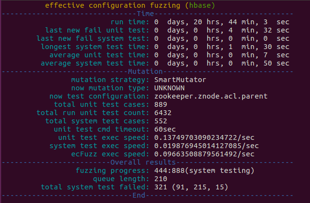

# ECFuzz: Effective Configuration Fuzzing

## Introduction

An effective configuration fuzzer for large-scale software systems. 

This is the open-source codes for our submitted paper *ECFuzz: Effective Configuration Fuzzing* to ISSTA 2023.

> Note that this version is partial of  our codes, the complete version would be accessable after our paper is accepted. 

## Runtime Preview

