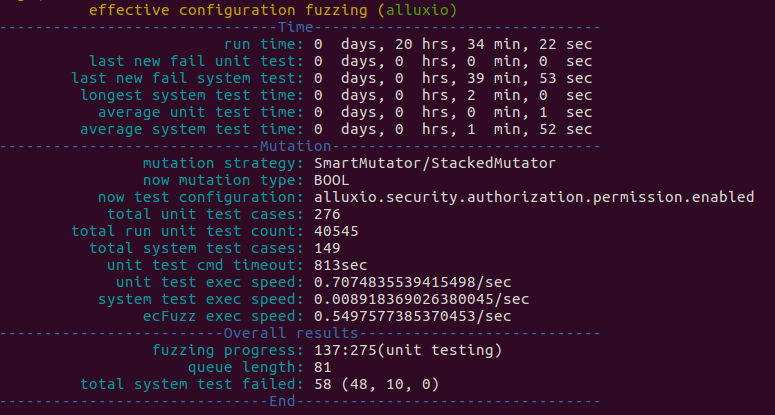

# ECFuzz: Effective Configuration Fuzzing for Large-Scale Systems

## Introduction

An effective configuration fuzzer for large-scale systems.
46th International Conference on Software Engineering (ICSE 2024) 

## Runtime Preview



## Experiment Data Link
Experiment Data: ./Experiment Data/Exp-RQ4.xlsx and ./Experiment Data/Exp-data-of-ECFuzz.xlsx

Exption Crash Files: ./Experiment Data/exception_crash

## Usage 

Please see `data/README.md`. **Some files related to java scripts are also in `data/README.md`**.

You can also use docker image from docker hub like below
```shell
sudo docker pull ecfuzz/ecfuzz:1.2
sudo docker run -it --privileged --name icse-ecfuzz ecfuzz/ecfuzz:1.0 /bin/bash
# and then enter the docker container, and run the fuzzer
cd ecfuzz/src
python3 fuzzer.py
```

## Others
There is a more detailed readme at this location(./Experiment Data/AE-README.md).
